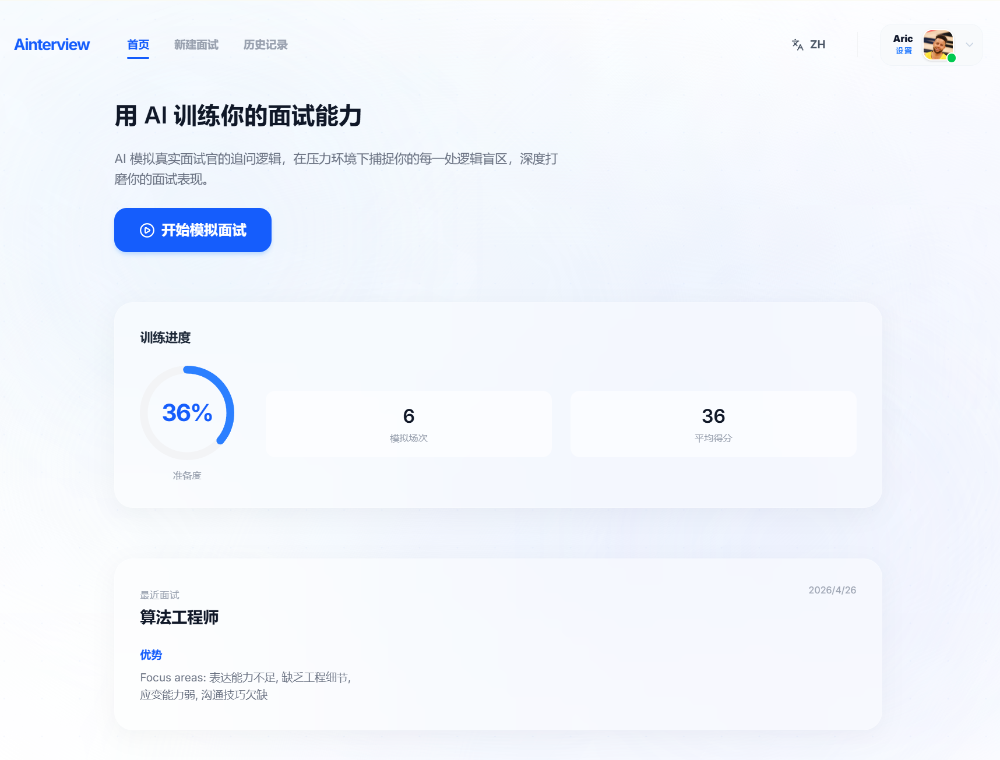
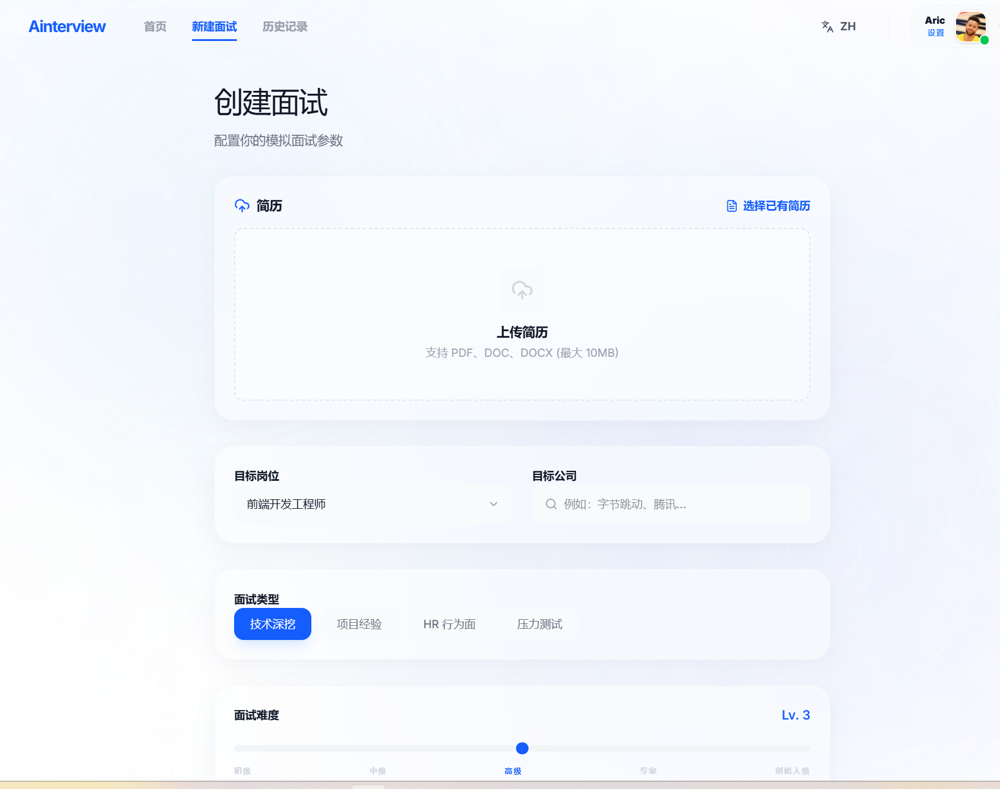
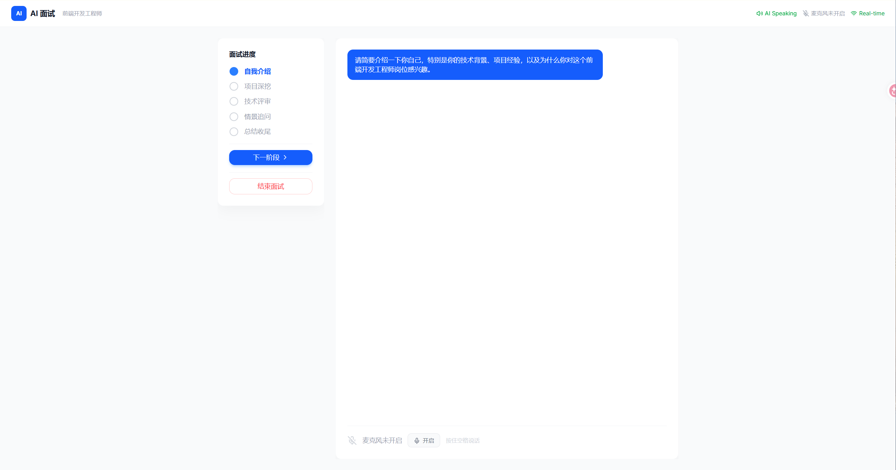
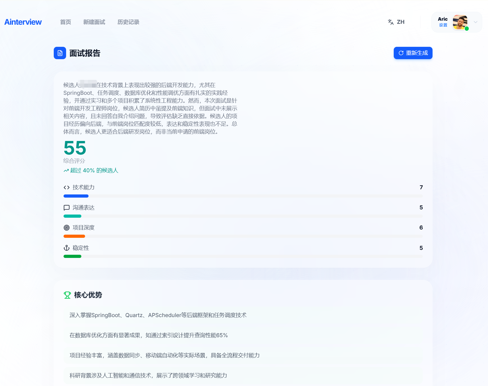
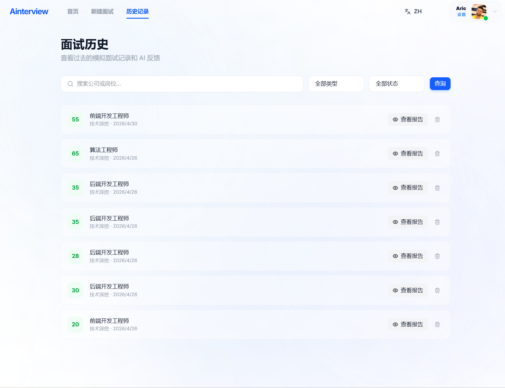

# AInterview - AI 面试系统

AI 驱动的面试练习平台，支持语音识别、实时问答和智能评分。

## 快速启动

```bash
# 后端
cd backend
cp .env.example .env
npx prisma generate
npx prisma migrate dev --name init
npm run dev       # http://localhost:3001

# 前端
cd frontend
npm install
npm run dev       # http://localhost:5173
```

## 技术栈

**前端**: React + TypeScript + Vite + Tailwind CSS
**后端**: Node.js + Express + TypeScript + Prisma + PostgreSQL
**AI**: DeepSeek (问答/评分) + DashScope Paraformer (语音识别)
**实时**: Socket.IO + WebSocket STT proxy

## 页面

首页、创建面试、面试房间、面试报告、训练中心、历史记录、个人中心

## 项目结构

```
AInterview/
├── frontend/         # React 前端 (Vite + Tailwind)
├── backend/          # Express 后端 (Prisma + PostgreSQL)
├── files/            # 项目文档
│   ├── PRD_files/    # 产品需求文档 (1.0.0 ~ 3.0.0)
│   ├── design_files/ # 各模块设计方案
│   └── process_files/ # 开发阶段产出记录
└── README.md
```

## 文档

- [backend/README.md](backend/README.md) — 后端快速启动和 API 列表
- [backend/DEVELOPMENT.md](backend/DEVELOPMENT.md) — 开发指南和架构
- [backend/TEST.md](backend/TEST.md) — API 测试示例

## 界面截图

| 首页 | 创建面试 |
|------|----------|
|  |  |

| 面试房间 | 面试报告 | 面试历史 |
|----------|----------|----------|
|  |  |  |