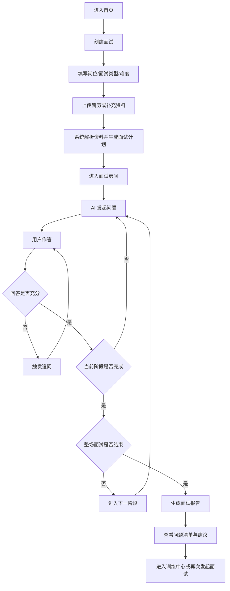
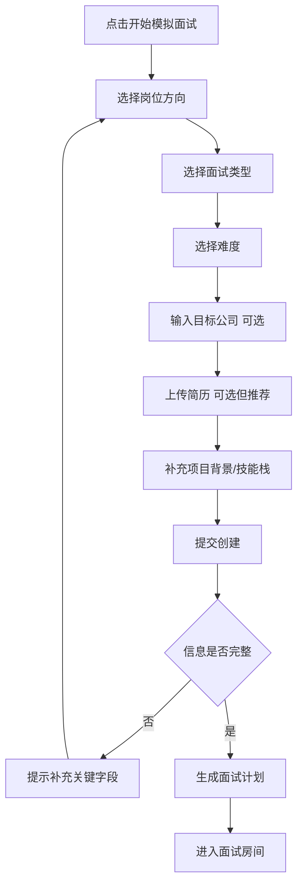
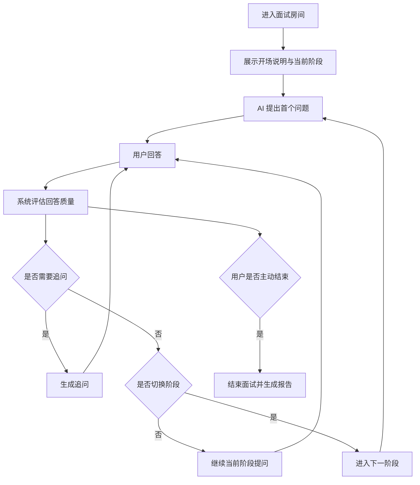
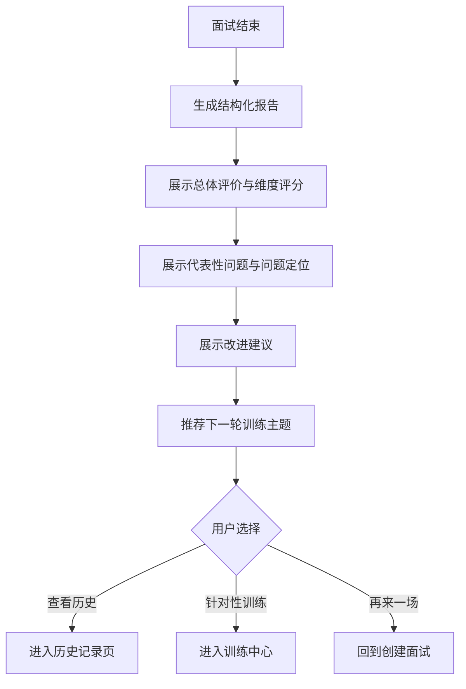
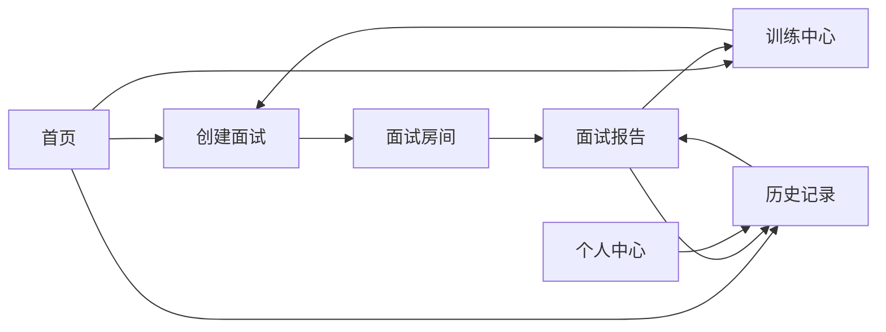

# 文档信息
用于记录产品需求文档的版本状态与迭代历史。

## 文档状态
- 当前版本：2.0.0
- 当前阶段：方案设计 / 中稿评审
- 产品类型：Web 网页优先，后续可扩展小程序 / App。
- 核心目标：在 1.0 闭环基础上补充业务流程、功能流程、信息架构与页面方案，支撑后续研发落地。

## 更新记录
| 版本号 | 版本状态 | 更新内容 | 时间 |
| --- | --- | --- | --- |
| 1.0.0 | 优化稿 | 明确需求背景、目标用户、功能范围、核心指标与优先级。 | 2026年4月17日 |
| 2.0.0 | 中稿 | 补充核心业务流程、功能流程图、信息架构、页面方案与模块职责。 | 2026年4月17日 |

## 方案概述
2.0.0 文档基于 1.0.0 的产品定义继续向下细化，目标不是重新定义需求，而是把“要做什么”进一步落成“怎么组织流程、页面和模块”。首要任务仍然是保证文本模拟面试闭环可落地，同时为后续个性化训练、能力模型与代码面试预留结构。

本阶段重点解决以下问题：
- 用户如何从首页快速进入一场面试。
- AI 面试如何在不同阶段推进，并触发追问、结束与报告生成。
- 报告、历史记录、训练中心之间如何形成复训闭环。
- 系统内部需要哪些能力模块来支撑前端体验。

## 版本关系说明
- 1.0.0 解决的是“产品做什么、先做哪些”。
- 2.0.0 解决的是“核心流程怎么跑、页面怎么搭、模块怎么拆”。
- 3.0.0 再继续补 UI 设计稿、边缘场景、埋点方案与交互细节。

## 核心业务流程图
用户完成一次训练的主链路如下：

## 核心业务闭环说明
- 流量入口：用户从首页进入，最核心目标是尽快开始一次面试，而不是在首页停留过久。
- 核心体验：面试房间是产品主战场，需要保持连续性、沉浸感和明确的阶段推进。
- 结果沉淀：报告页承担复盘和说服用户“这次训练有价值”的任务。
- 复训闭环：训练中心和历史记录共同承接用户的二次使用，形成留存。

## 功能流程设计
### 流程一：创建面试

创建面试页需要解决两个平衡：
- 不能让用户填太多字段，避免开始成本过高。
- 也不能信息过少，否则 AI 只能生成泛化问题，真实感下降。

建议 1.0 和 2.0 的输入策略如下：
- 必填：岗位方向、面试类型、难度。
- 选填但强引导：目标公司、简历、补充资料。
- 自动生成：面试阶段计划、问题方向、追问重点。

### 流程二：AI 面试会话

面试会话的核心控制点：
- 阶段状态：自我介绍、项目深挖、技术考察、场景追问、总结。
- 问题来源：系统初始计划 + 上下文动态生成。
- 追问条件：回答过浅、缺少细节、存在矛盾、偏离问题。
- 结束条件：完成预设轮次、阶段全部完成、用户主动结束。

### 流程三：报告与复训

## 信息架构
### 页面结构

### 页面层级说明
- 首页：产品介绍、快速开始入口、历史入口、训练入口。
- 创建面试：配置岗位、类型、难度、资料上传与创建动作。
- 面试房间：完整承载 AI 对话、阶段信息、进度状态、结束动作。
- 面试报告：查看评分、问题、建议、训练推荐。
- 训练中心：围绕薄弱点组织复训内容。
- 历史记录：按时间查看已完成面试与报告。
- 个人中心：管理基础资料、默认简历、偏好设置。

## 页面方案
### 1. 首页
目标：
- 用最短时间让用户理解产品价值并开始第一次面试。
- 承接回访用户进入历史记录或训练中心。

核心模块：
- 顶部价值说明。
- 开始模拟面试按钮。
- 最近训练记录入口。
- 热门训练方向或推荐岗位方向。

### 2. 创建面试页
目标：
- 让用户在低认知负担下完成配置。
- 尽可能收集足够信息支撑个性化提问。

核心字段：
- 岗位方向。
- 面试类型。
- 难度等级。
- 目标公司。
- 简历上传。
- 补充说明，如项目关键词、技能栈、求职方向。

关键交互：
- 表单实时校验。
- 简历上传后展示解析状态。
- 创建成功后直接进入面试房间。

### 3. 面试房间
目标：
- 提供沉浸式、连续性的 AI 面试体验。

页面结构建议：
- 左侧或顶部：当前阶段、轮次、剩余进度。
- 中间主区域：AI 提问与用户回答的会话流。
- 右侧辅助区：面试设置、资料摘要、可选即时反馈开关。
- 底部输入区：回答输入框、发送按钮、结束面试按钮。

关键状态：
- 正在生成问题。
- 正在等待用户回答。
- 正在生成追问。
- 面试结束处理中。

### 4. 面试报告页
目标：
- 让用户快速看懂本场表现，并愿意继续训练。

核心内容：
- 总体评价摘要。
- 维度评分卡片。
- 代表性问答复盘。
- 薄弱点标签。
- 改进建议。
- 推荐训练入口。

### 5. 训练中心
目标：
- 把一次性面试转化为可持续训练。

核心内容：
- 按薄弱点分类的训练主题。
- 推荐二次训练任务。
- 最近提升趋势摘要。

### 6. 历史记录页
目标：
- 帮助用户快速回看曾经的面试表现和进步轨迹。

核心内容：
- 按时间排序的面试记录列表。
- 每场记录的岗位、类型、时间、总评、标签。
- 快速查看报告和再次训练入口。

## 关键对象设计
为便于后续研发拆分，建议明确以下核心对象：

| 对象 | 说明 | 核心字段建议 |
| --- | --- | --- |
| User | 用户实体 | 用户名、邮箱、偏好、默认岗位方向 |
| Resume | 简历实体 | 文件地址、解析结果、上传时间、归属用户 |
| InterviewSession | 一场面试会话 | 岗位、类型、难度、状态、开始结束时间 |
| InterviewPlan | 面试计划 | 阶段列表、问题方向、追问策略 |
| QuestionNode | 单个问题节点 | 所属阶段、问题内容、问题类型、是否追问 |
| AnswerRecord | 用户回答记录 | 回答内容、回答时间、评估结果 |
| Report | 面试报告 | 总评、评分、问题列表、建议、推荐训练 |
| TrainingTask | 训练任务 | 薄弱点标签、任务类型、推荐理由 |
| KnowledgeAsset | 资料实体 | JD、补充说明、项目资料、来源类型 |

## 模块职责拆分
从系统实现角度，可先拆为以下模块：

| 模块 | 主要职责 |
| --- | --- |
| 前端应用层 | 承载页面、会话体验、表单与状态展示 |
| 面试编排模块 | 负责控制阶段推进、轮次与结束条件 |
| 资料解析模块 | 解析简历、JD 与补充资料，抽取可用信息 |
| 问题生成模块 | 基于计划和上下文生成问题与追问 |
| 回答评估模块 | 判断回答是否充分，提取亮点与问题 |
| 报告生成模块 | 汇总本场面试，输出结构化报告 |
| 训练推荐模块 | 基于报告推荐下一轮训练主题 |
| 数据存储模块 | 保存用户、会话、记录、报告和资料 |

## 2.0 功能优先级建议
### P0：必须明确并设计落地
- 首页到创建面试的路径。
- 文本面试房间结构与状态流转。
- 报告页的信息呈现结构。
- 历史记录与再训练入口。

### P1：建议在方案层面预留
- 训练中心。
- 用户上传 JD / 项目资料。
- 标签化弱点体系。

### P2：只做结构预留，暂不深入
- 用户能力模型看板。
- 在线代码面试。
- 多模态语音 / 视频面试。

## 关键设计建议
- 首页不要堆过多介绍，核心 CTA 只有一个：开始模拟面试。
- 面试房间要保持“每次只做一件事”，避免同时展示过多分析信息破坏沉浸感。
- 即时反馈建议默认弱化，主要价值仍然放在结束后的结构化报告。
- 报告页要突出“为什么得这个分”和“下一步练什么”，否则用户很难复训。
- 页面结构上要为未来的代码面试、能力模型预留导航位置，但不要在当前版本堆出空壳页面。
